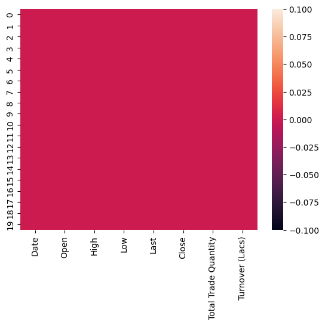
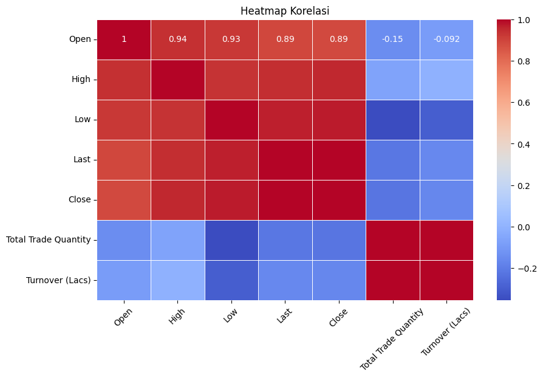
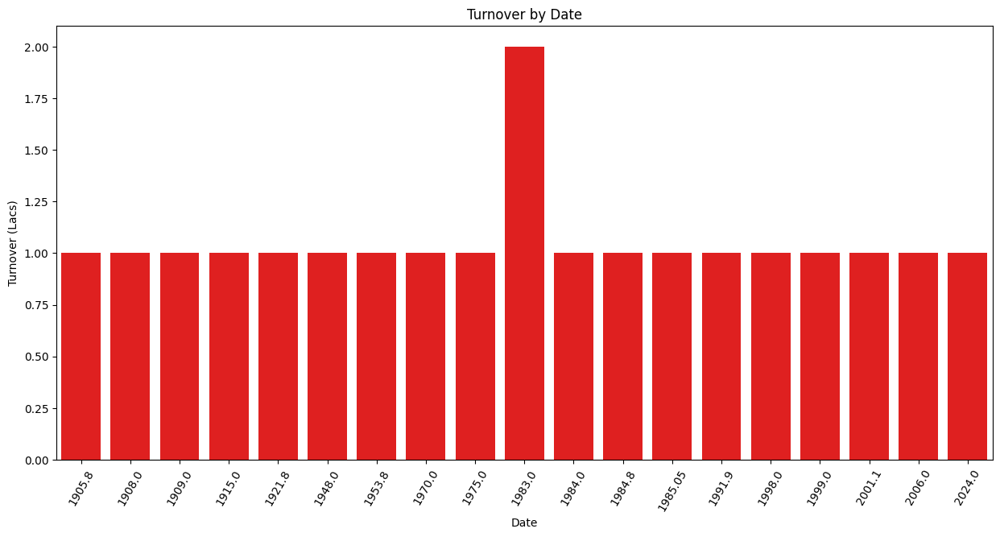
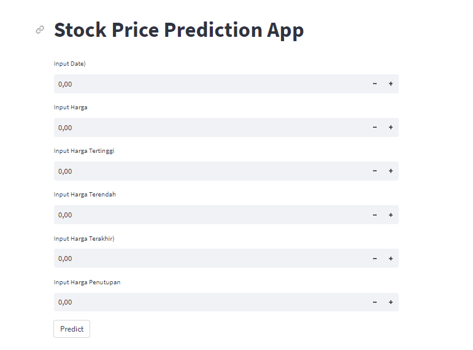

# Laporan Proyek Machine Learning
### Nama : Iqsai Indra Nugraha
### Nim : 191351041
### Kelas : If pagi B

## Domain Proyek

Proyek ini bertujuan untuk memprediksi pergerakan harga saham menggunakan model regresi linear.proyek ini akan mencoba mengidentifikasi pola dan tren yang mungkin memengaruhi harga saham, serta memprediksi harga saham di masa depan berdasarkan data historis yang telah ada.

## Business Understanding

Dalam proyek "Prediksi Pergerakan Harga Saham menggunakan Regresi Linear," pemahaman bisnis adalah kunci untuk meraih keberhasilan. Bisnis ini bertujuan untuk membantu para investor dan trader saham dalam mengambil keputusan investasi yang lebih baik dengan menggunakan model analisis data. 

### Problem Statements

Harga saham dipengaruhi oleh berbagai faktor seperti berita, peristiwa ekonomi, dan psikologi pasar. Memprediksi harga saham dengan tingkat akurasi tinggi adalah tugas yang rumit.

 ### Goals
 
menghasilkan model regresi linear yang dapat memprediksi harga saham dengan tingkat akurasi yang dapat membantu para investor membuat keputusan investasi yang lebih terinformasi.

  ### Solution statements
  - Membangun model regresi linear yang memanfaatkan atribut-atribut yang telah dipilih untuk memprediksi harga saham di masa depan.
  - Menggunakan model yang sudah dilatih untuk memprediksi harga saham di masa depan. Hasil prediksi akan divisualisasikan untuk memahami sejauh mana model berkinerja.

  ## Data Understanding
  Dalam tahap ini, kami akan menjalankan analisis awal terhadap data mengenai "Stock Market" yang akan digunakan untuk mengembangkan model regresi linear.

  https://www.kaggle.com/code/spidy20/stock-market-prediction-with-linear-regression/output

  ### Variabel-variabel pada Europe bike store sales adalah sebagai berikut:
  1. Date = object 
  2. Open = float
  3. High = float
  4. Low = float
  5. Last = float
  6. Close = float
  7. Total = float
  8. Trade Quantity = float
  9. Turnover (Lacs) = float

## Data Preparation

### Data Collection
Data ini merupakan koleksi historis harga saham dari beberapa perusahaan terkemuka di sektor teknologi, keuangan, dan energi. Data ini mencakup informasi harga harian selama beberapa tahun terakhir, termasuk atribut seperti harga penutupan harian, dan atribut lainnya.

### Data Discovery And Profiling
Pertama tama kita harus mengimport library-library yang dibutuhkan 
``` bash
import pandas as pd
import numpy as np
import seaborn as sns
import matplotlib.pyplot as plt
from sklearn.linear_model import LinearRegression
from sklearn.model_selection import train_test_split
```
selanjutnya dengan memasukan dataset dan untuk melihat 10 data di urutan paling atas
```bash
df = pd.read_csv('TCS.csv')
df.head()
```
melihat type data 
``` bash
df.info()
```
untuk melihat data yang kosong 
``` bash
sns.heatmap(df.isnull())
```
 <br>

deskripsi dataset
```bash
df.describe()
```
Disini kita akan membuat Heatmap korelasi dari dataframe
``` bash
plt.figure(figsize=(10, 6))
heatmap = sns.heatmap(df.corr(), annot=True, cmap='coolwarm', linewidths=.5)
plt.title('Heatmap Korelasi')
plt.xticks(rotation=45)
plt.show()
```


Lalu kita akan membuat bar plot yang menunjukan data dalam DF berdasarkan kolom 'Open' (misalnya, harga pembukaan) untuk setiap nilai yang unik dalam kolom tersebut

``` bash
brands = df['Open'].value_counts().reset_index()
brands.columns = ['Date', 'Turnover (Lacs)']
```
``` bash
plt.figure(figsize=(15, 7))
sns.barplot(data=brands, x='Date', y='Turnover (Lacs)', color='red')
plt.xticks(rotation=60)
plt.xlabel('Date')
plt.ylabel('Turnover (Lacs)')
plt.title('Turnover by Date')
plt.show()
```


  ## Modeling
  langkah ini diawali dengan seleksi fitur
```bash
x = df.loc[:,'High':'Turnover (Lacs)']
y = df.loc[:,'Open']
```

langkah ini adalah tahap split data testing dan data training
```bash
from sklearn.model_selection import train_test_split
x_train,x_test,y_train,y_test = train_test_split(x,y,test_size = 0.1,random_state = 0)
```

selanjutnya membuat model regresi linier
```bash
LR = LinearRegression()
LR.fit(x_train,y_train)
```

untuk mengevaluasi data 
```bash
y = LR.score(x_test, y_test)
print('Akurasi Model Regresi Linier : ', y)
```
Akurasi Model Regresi Linier :  1.0

 "Akurasi Model Regresi Linier: 1.0" mengindikasikan bahwa model regresi linier telah memberikan hasil prediksi yang sempurna atau 100% akurat terhadap data yang digunakan untuk menguji atau melatih model. Nilai akurasi 1.0 (atau 100%) berarti bahwa model regresi linier telah mampu memprediksi setiap sampel dengan benar dan tidak melakukan kesalahan apapun dalam estimasi.

## Evaluasi
``` bash
#Open) = 2024, High	= 2029 , Low = 7.85 , Last	 = 2016 , Close = 2016,  Total Trade Quantity = 4.9 
inputan = np.array([[2024, 2029, 1985, 2016, 2016, 4.9]])
prediksi = LR.predict(inputan)
print('Estimasi Jumlah TO dalam setiap size menu : ', prediksi)
```

## Deployment

  [Aplikasi](https://tugasuts-fsy7f2kbb9aqupdhfmjjfs.streamlit.app/)

  
